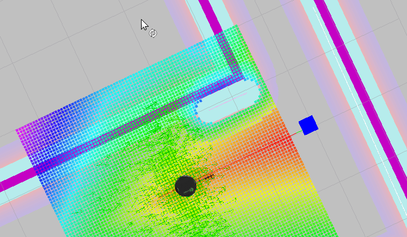
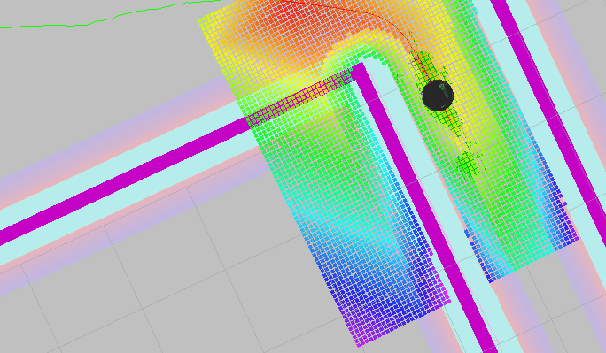

# Udacity Robotics ND - Home Service Robot

The Home Service Robot is the final project of the Udacity Robotics Software Engineer nanodegree, a capstone project which uses all the concepts learned in the course to develop a robot that can navigate around indoor environments, perform SLAM to generate a map and navigate in the environment to pick and place objects around the room.

# Images

The robot navigating to the object.

The robot navigating to the destination

## Packages used in the project

 - Turtlebot: this package is used to simulate a Turtlebot  robot in our environment
 - Turtlebot-teleop: This package is used to send telemetry commands to our robot.
 - slam-gmapping: This package performs laser based SLAM, using it with turtlebot-teleop, the robot can be moved around the room to generate a binary occupancy map which can be used later for localization and navigation.
 - amcl: This package performs Advanced Monte Carlo Localization, an algorithm that uses particle filters to locate our robot.
 - navigation: This packages implements the Navigation Stack which allows us to send a navigation goal for our robot, the underlying algorithm used for path planning is Dijkstra's Algorithm.
 - rviz: This package let us use Rviz, a visualization tool to see how well performs our robot. 
 - pgm_map_creator: This package is used only in simulated environments to quickly generate a binary occupancy grid.

## Packages created by me

 - pick_objects: This package send a navigation goal to our robot so it can pick, carry and place objects around the room.
 - add_markers: This package publishes markers that are displayed in Rviz, for evaluating proposes.

## System Requirements and Installation 

To run the following project you should have:

 - A linux OS, preferably Ubuntu with ROS installed(minimum Kinetic)
 - xterm installed

Installation instructions:

 1. Create a new catkin workspace
 2. Clone the repository
 3. Check for missing dependencies using rosdep -i
 4. Build the project

## Running the progam
After you cloned the project and installed all the dependencies + xterm, open a terminal and from the project workspace execute the following bash script:

    ./home_service.sh
